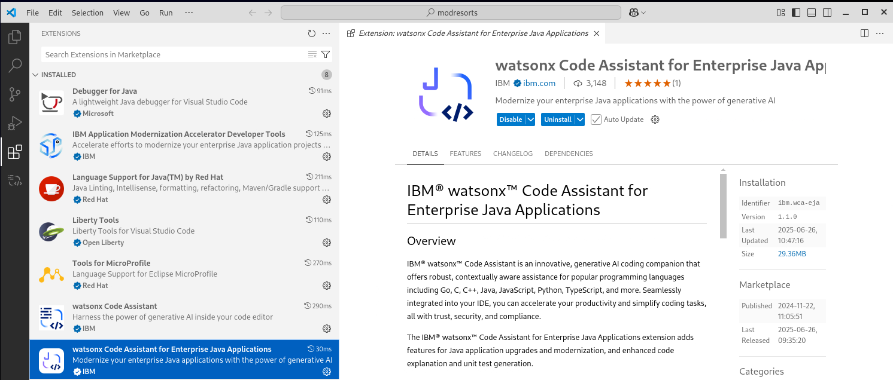
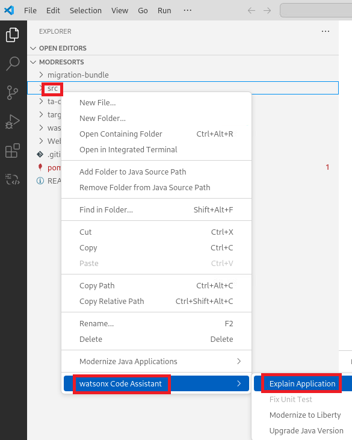
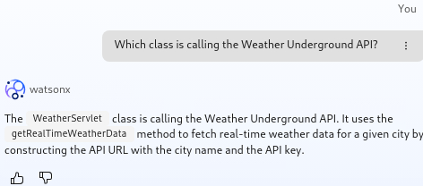
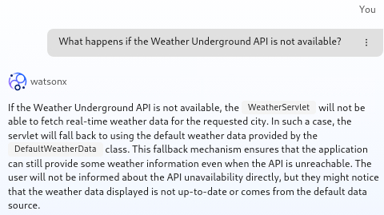
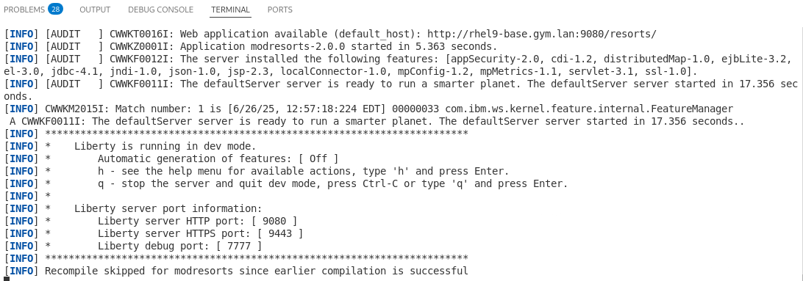
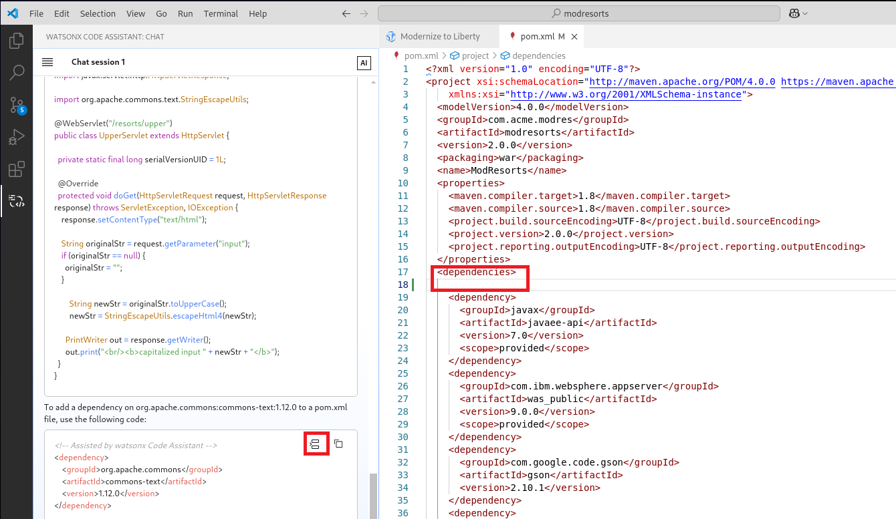
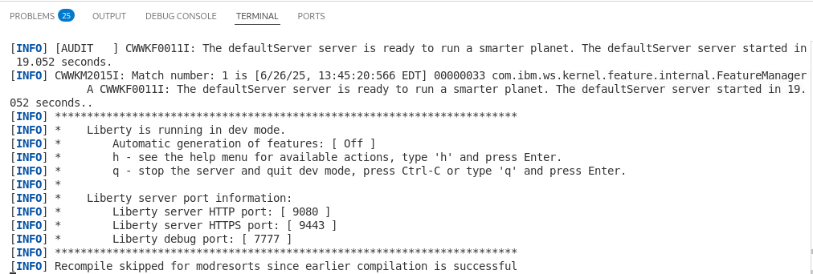

# Lab: Using watsonx Code Assistant with VS Code

## Objectives

In this exercise, you will learn how developers can use watsonx Code Assistant with VS Code Integrated Development Environment for modernizing an existing Java Enterprise Application. 

At the end of this lab, you should be able to:

  - use watsonx Code Assistant to explain existing Java Enterprise Code
  - use watsonx Code Assistant to modernize an existing WebSphere Traditional application to Liberty
  - use watsonx Code Assistant to update an existing Java Enterprise Application to Liberty
  

You will need an estimated **60 to 90 minutes** to complete this lab.

## Lab requirements

Use the lab environment that we prepared for this lab. It already has the prerequisite software installed and configured.

### Required software
To perform the exercise, the following software is required:
- Java 17 or Java 21
- Maven 
- Git (Optional but recommended:)
- Visual Studio Code
- Visual Studio Code extensions
    - watsonx Code Assistant for Enterprise Java application
    - Liberty Tools

### Connectivity
Internet access is required to download artefacts from the maven repository.
  
## Introduction – watsonx Code Assistant
IBM watsonx Code Assistant is an innovative, generative AI coding companion that offers robust, contextually aware assistance for popular programming languages including Go, C, C++, Java, JavaScript, Python, TypeScript, and more. Seamlessly integrated into your IDE, you can accelerate your productivity and simplify coding tasks, all with trust, security, and compliance.

- **AI-powered coding tasks**: Code generation, explanation, unit test, creation, AI-derived code documentation, and more.
- **Chat for code**: Free-form AI conversational chat for planning applications and writing code.
- **Prebuilt chat commands**: Use optimized prompts for specific tasks.
- **Integrated directly into IDEs**: Available directly within Visual Studio Code and Eclipse, integrating seamlessly with your workflow.

 

In this lab, you will use the **watsonx Code Assistant** to understand and modernize an existing Java Enterprise application.

## Accessing the lab environment

If you are doing this lab as part of an instructor led workshop (virtual or face to face), an environment has already been provisioned for you. The instructor will provide the details for accessing the lab environment.

Otherwise, you will need to reserve an environment for the lab. You can obtain one here. Follow the on-screen instructions for the “**Reserve now**” option.

**TBD: Link to be updated**

<https://techzone.ibm.com/my/reservations/create/660d7f062945d2001e009449>

 The lab environment contains one (1) Linux VM, named **Workstation**.

  
    
  The Ubuntu Linux **Workstation** VM has the following software installed for the lab:
  
  - Maven 3.6.0 
  - IBM Semeru Runtime Open Edition 17.0.8.1
  - Visual Studio Code 1.95.2
    - Liberty Tools Plugin
    - watsonx Code Assistant plugins for Core and Enterprise Java
   

1. Access the lab environment from your web browser. 
    
    A `Published Service` is configured to provide access to the **Workstation** VM through the noVNC interface for the lab environment.
    
    a. When the demo environment is provisioned, click on the **environment tile** to open its details view. 

    b. Click on the **Published Service** link which will display a **Directory listing**  
    
    c. Click on the **"vnc.html"** link to open the lab environment through the **noVNC** interface. 
    
    
    
    d. Click the **Connect** button 
    
      

    e. Enter the password as:  **`IBMDem0s!`**. Then click the **`Send Credentials`** button to access the lab environment. 

    > Note: That is a numeric zero in IBMDem0s!  

      <kbd></kbd>

	 
	  

2. If prompted to Login to the "workstation" VM, use the credetials below: 

    The login credentials for the **workstation”** VM is:
 
     - User ID: **techzone**

     - Password: **IBMDem0s!**

     > Note: That is a numneric zero in the password

	  
 
     <kbd></kbd>
	 
	  
	
3.  Once you access the **Student VM** through the published service, you will see the Desktop, which contains all the programs that you will be using (browsers, terminal, etc.)

   

|         |           |  
| ------------- |:-------------|
|    | 
<strong>IMPORTANT:</strong>

Using the lab environment provided, all the required VS code extensions and dependencies have been installed for you.

This allows you to focus on the value of using the capabilities of the tools for fast, efficient inner-loop development, test, debug, of Java based applications and Microservices using Open Liberty in dev mode.

 |
   

## Tips for working in the lab environment     

1. You can resize the viewable area using the **noVNC Settings** options to resize the virtual desktop to fit your screen.

    a. From the environemnt VM, click on the **twisty** on the noNC control pane to open the menu.  

    

    b. To increase the visible area, click on `Settings > Scaling Mode` and set the value to `Remote Resizing`
      
     

2.  You can copy / paste text from the lab guide into the lab environment using the clipboard in the noVNC viewer. 
   
    a. Copy the text from the lab guide that you want to paste into the lab environment
    
    b. Click the **Clipboard** icon and **paste** the text into the noVNC clipboard

    
    
    c. Paste the text into the VM, such as to a terminal window, browser window, etc. 

    d. Click on the **clipboard** icon again to close the clipboard

    > **NOTE:** Sometimes pasting into a Terminal window in the VM does not work consistently. 
    
    > In this case you might try again, or open another Terminal Window and try again, or  paste the text into a **Text Editor** in the VM, and then paste it into the Terminal window in the VM. 

3. An alternative to using the noVNC Copy / Paste option, you may consider opening the lab guide in a web browser inside of the VM. Using this method, you can easily copy / paste text from the lab guide without having to use the noVNC clipboard. 

   

<!-- LBH: Added description how to access toolbar -->
4. Click on the **Activities** icon within the VM to switch between different windows or get access the tool bar.
    <kbd></kbd>

    You will see the toolbar.

    <kbd></kbd>
    
     

### If, at aytime during the lab, you ar asked to install updates, click CANCEL!

|         |           |  
| ------------- |:-------------|
|    | 
<strong>Important:</strong> 
<strong>Click CANCEL</strong>…. If, at any time during the lab, you get a pop-up asking to install updated software onto the Ubuntu VM.
 
The one we experience is an update available for VS Code.

<strong>CLICK CANCEL!</strong>

 |

## Getting Started with watsonx Code Assistant for Enterprise Java applications

Here some additional information which should allow you to get a better understanding about the environment and how it has been set up.

### Source code

The source code here is provided in zips. You can unzip the code and run the Modernize to Liberty and Java Upgrade scenarios locally without the code in a git repo, however, it might be convenient to have a repo so that you can track and review the changes that are happening. For the differential summaries scenario, the code will need to be in a git repo.

- modresorts-twas-j8.zip
    - This is the version of ModResorts that can be deployed traditional WebSphere Application Server. It is built with and targeted and Java 8. This is the starting point for running the scenarios.
    - Its a Maven project and in addition to the source code, it contains the migration bundle from Transformation Advisor migration-bundle/modresorts.ear_migrationBundle.zip. This will be required when running the WebSphere to Liberty migration.

- modresorts-lib-j8.zip
    - This is the version of ModResorts after it has been modernized to Liberty. It contains Liberty configuration, and all code changes necessary for the application to run correctly on Liberty have been made. It is still build with and targeted at Java 8.
    - The archive is only required if you so not want to start with modresorts-twas-j8.zip or run into issues.

- modresorts-lib-j21.zip
    - This is the version of ModResorts after it has been modernized to Liberty and it has been upgraded to Java 21.
    - The archive is only required if you so not want to start with modresorts-twas-j8.zip or run into issues.

### Building the Source

- WebSphere APIs
The ModResorts application uses WebSphere APIs. In order to build the ModResorts application in its original state, the WebSphere library must be available in your environment. You can use the following command to install the WebSphere public jar into your local maven repository where the build can automatically pick it up from:
mvn install:install-file -Dfile=<location>/was_public.jar -DpomFile=<location>/was_public-9.0.0.pom

- Java version information
ModResorts is a Java 8 application. That is to say, it is built with Java 8 and targets a Java 8 environment. However, the nature of the code in the case of ModResorts, is such that it will compile with higher Java versions up to Java 21. The Java upgrade scenario described below can take advantage of this to simplify the flow, otherwise, you would need to change the JDK in the middle of the demo, because after the Java 21 changes have been made to the application, Java 21 must be used to build the application. Older Java versions will not be able to build the application.
For the Java upgrade scenario, I recommend configuring the IDE such that it is always building the project with Java 21. In addition, ensure that JAVA_HOME is pointing to Java 21. This will ensure that when the Build and refresh button is clicked (see scenario below), Java 21 will be used for the build.
Of course not all Java 8 applications can be built with a higher level of Java. In cases where applications use Java 8 APIs that have been removed in newer versions, Java 8 would be required in order to build. 
 
### Integrated Development Environment (IDE)

The scenario is described here with reference to Visual Studio Code (VS Code) but would also work similar with Eclipse (2023 12). 
Liberty Tools can be installed in the IDEs to allow us to run the application in Liberty.
Related links:
- https://openliberty.io/blog/2022/08/01/liberty-tools-eclipse.html
- https://marketplace.visualstudio.com/items?itemName=Open-Liberty.liberty-dev-vscode-ext
In the prepared lab environment, the Visual Studio Code and the Liberty Tools are already installed. 
 

## Getting started

1.  **Close** all **Terminal** windows and **Browser** Tabs used in any previous lab.

2.  Use the **Activities** Icon to switch to the toolbar, then click the **Terminal** icon to open a Terminal window.

    <kbd></kbd>

3.  Clone the GitHub repo that includes artifacts required for this lab
    
        mkdir -p /home/techzone/Student/labs

        git clone https://github.com/openliberty/wca-guide-getting-started.git /home/techzone/Student/labs/wca
        
        cd /home/techzone/Student/labs/wca

4. Run the following command to set up the modresorts environment.

        . modresorts_demo_setup.sh

    Once completed, the local lab artifacts repo is cloned at the following directory on the desktop VM. 
    
    > **/home/techzone/Student/labs/wca/temp*/modresorts**

5.  Launch VS Code using the current directory as the root folder for
    the workspace

        code .

    If you get asked to trust the authors, lick on "Yes, I trust the authors".
    <kbd></kbd>
    
    When the VS Code UI launches, the Explorer view is shown. The “START” folder contains the source code for the project.

    <kbd></kbd>

     

4.  Review the installed extensions in VS Code that are used for this lab.
    
    a.  Click on the **Extensions** icon in the left navigation bar in
        VS Code.
        
    <kbd></kbd>
    
    b.  Expand the “INSTALLED” extensions section to list the extensions that are currently installed in this environment. The notable extensions used in this lab are:
        
    -  Liberty Tools
    -  Tools for MicroProfile
    -  Language Support for Java
    -  Debugger for Java
    - watsonx Code Assistant
    - watsonx Code Assistant for Enterprise Java Applications
    
     

    c. Click on the extension **watsonx Code Assistant for Enterprise Java Applications** to view its details.

    <kbd></kbd>

    d. Click on the extension **Liberty Tools** to view its details.

    <kbd></kbd>

    e. Switch back to the Project Explorer view and you should see the Liberty Dashboard at the bottom.

    <kbd></kbd>

## Using the watsonx Code Assistant

There are different ways to interact with watsonx Code Assistant.
- Use the **chat** 
    - to generate code, documentation, explanation and more via command line
    - to ask questions to watsonx Code Assistant
- Use the **Enterprise Java Application menu** project to access Enterprise Java capabilities such as 
    - Explain an application
    - Modernize an application to Liberty
    - Update the Java version 
- Use the functions embedded in the editor to explain code and more

### Using the watsonx Code Assistant Chat

1. Click on the shortcut for watsonx Code Assistant.

    <kbd></kbd>

2. In the chat session, you should see a Chat session.
 
    <kbd></kbd>
 
3. Enter **/help** and press **Enter** or click on the **blue arrow**.

    <kbd></kbd>

 
4. You should see a short introduction. Feel free to expand the different sections.

    <kbd></kbd>

### Build the war file via maven (necessary for the next steps)

1. Open a terminal window in VS Code.

    <kbd></kbd>

2. Run the command 

    mvn clean

    You should see something like

    <kbd></kbd>

    Make sure that you get a **BUILD SUCCESS** message

3. As the modresorts project depends on was_public.jar, you must make it visible to maven to avoid build failures. Run the following command 

    mvn install:install-file -Dfile=./was_dependency/was_public.jar -DpomFile=./was_dependency/was_public-9.0.0.pom

    You should see something like

    <kbd></kbd>

    Make sure that you get a **BUILD SUCCESS** message

4. Run the command to package the application

    mvn package

    You should see something like

    <kbd></kbd>

    Make sure that you get a **BUILD SUCCESS** message

Hint: 
1. Without installing the file was_public.jar into maven, the maven command would fail with an error like this: 

        [ERROR] Failed to execute goal on project modresorts: Could not resolve dependencies for project com.acme.modres:modresorts:war:2.0.0: The following artifacts could not be resolved: com.ibm.websphere.appserver:was_public:jar:9.0.0 (absent): com.ibm.websphere.appserver:was_public:jar:9.0.0 was not found in https://repo.maven.apache.org/maven2 during a previous attempt. This failure was cached in the local repository and resolution is not reattempted until the update interval of central has elapsed or updates are forced -> [Help 1]
2. The build of the application is needed to perform watsonx Code Assistant tasks on Enterprise Java Application level (e.g. explain, modernize, upgrade).

### Scenario: Understand the Java Enterprise application modresorts
One of theh challenges during a modernization project is often, that there is no good documentation about the application code available. Often also the developers that developed the application initially are no longer available.
You will use the explain capabilities in watsonx Code Assistant to get a better understanding of the Java Enterprise applications. 
This will include three parts:

- Get a better understanding of the modresorts application overall by using some of the Enterprise Java Application capabilities of watsonx Code Assistant.
- Get a better understanding of modresorts classes and methods or other files by using some of the core capabilities of watsonx Code Assistant.
- Get a better understanding of the modresorts applications by asking questions by using some of the core capabilities of watsonx Code Assistant.
 
#### Use watsonx Code Assistant to explain the code

1. Within the project, click on the Project Explorer shortcut.
  
    <kbd></kbd>

2. Right-click on **src** and select **watsonx Code Assistant > Explain Application**
 
    <kbd></kbd>

 
3. You will get a pop-up like:

    <kbd></kbd>

4. Click on **Proceed with code analysis**. 
You will see something several messages

    <kbd></kbd>

    Then after a minute or so:

    <kbd></kbd>

    And then

    <kbd></kbd>

5. Click on Open explanation to see the results.
 
    <kbd></kbd>

#### Use the wizard inside the application code to explain a class:

1. In the Project Explorer, expand the **src** directory and open the file **WeatherServlet.java**.

 
    <kbd></kbd>

2. Scroll down to **line 45**.

    <kbd></kbd>

3. Click on **Explain** in the line above line 45 to get the explanation for the class.
This will trigger watsonx Code Assistant to analyze the code.

4. The WCA chat window will open to explain the WeatherServlet. Take a look at the resulting explanation.

    <kbd></kbd>

#### Use the chat command to explain a class or method:
Another way to get an explanation for a class is to use the chat window directly.

1. Enter into the chat window the text **/explain @ModResortsCustomerInformation.java**

    <kbd></kbd>

2. Press Enter and you should get an explanation like:

    <kbd></kbd>

#### Use the WCA chat to ask questions about the application
As mentioned above, the chat function within watsonx Code Assisant can also be used to ask questions about the code for example. Here some examples

1. In the chat window, enter the question: **Where does the weather data come from?**

    <kbd></kbd>

    The answer could look like this:

    <kbd></kbd>

    
2. In the chat window, enter the question: **Which class is calling the Weather Underground API?** and take a look at the result.

    <kbd></kbd>

    
3. In the chat window, enter the question: **What happens if the Weather Underground API is not available?** and take a look at the result.

    <kbd></kbd>

    
4. In the chat window, enter the question: **Where is the default weather data defined?** and take a look at the result.

    <kbd></kbd>

5. To better understand the **DefaultWeatherData** class, ask for an explanation by entering

        /explain @DefaultWeatherData

    watsonx Code Assistant will provide an explanation of the class.

    <kbd></kbd>

There are additional questions that you could ask. For example:

- What is the Weather Underground API?
- Who is providing the Weather Underground API? 
- What is the URL of the Weather Underground API? 
 
#### Summary
As you could see, watsonx Code Assistant makes it much easier to understand the code. Instead of having to read through all the application code, you can get explanations or ask questions or even use a combination to get the nsiht that you need.

Additional capabilities that have nbot been covered as part of the section are the generation of code documentation for example.

### Scenario: Modernize the modresorts application from WebSphere Traditional to Liberty

watsonx Code Assistant helps with the application modernize from a traditional application server like WebSphere Application Server Traditional, Oracle WebLogic, JBoss EAP or Tomcat to Liberty. It uses a binary scanner to scan the existing Java Enterprise applications and provides insight into issues when migrating to Liberty and/or another Java version. It also can scan the existing application server configuration.
The generated data collection can be used as input for Transformation Advisor to estimate modernization efforts as well as to generate the deployment artefacts as part of a migration bundle.
In this case, the IBM Transformation Advisor was used to scan the application and create a migration bundle which contains next to the reports about required code changes also the Liberty server configuration (server.ml).
The data collection can be found in the file **ta-collection/ AppSrv01.zip**, the generated migration bundle in the file **migration-bundle/modresorts.ear_migrationBundle.zip**

#### Analyze the applicatzion via watsonx Code Assistant for Enterprise Java Application 

1.	Switch to the **Project Explorer**, expand the **modresorts** application and right click on the **src** directory. Then select **watsonx Code Assistant > Modernize to Liberty**.

    <kbd></kbd>

    A panel opens and you can either upload a migration bundle or let the WCA extension scan the code. 

    <kbd></kbd>

 
2. Select the option Upload migration bundle.
 
In the pop-up **Open File**, navigate to the directory **/modresorts/migration-bundle**
and select the file **modresorts.ear_migrationBundle.zip**, the click on **Open**.
 
    <kbd></kbd>

    - That migration bundle has been generated by Transformation Advisor as a result of scanning the ModResorts application that was deployed to the traditional WebSphere Application Server environment. 
    - It contains configuration information for the application (the server.xml), and analysis that describes the issues that need to be addressed (the code changes that need to be made) in order for the application to run successfully on Liberty.

3. You should see the following screen after choosing the migration bundle:

    <kbd></kbd>

    - The **server.xml** contains the configuration for the application. 
    - The Containerfile can be used to build a Liberty image of your application (outside the scope of this scenario)
    
4. Click the button to **Proceed** the files to the project. You should see the following panel:
 
    <kbd></kbd>

    You will see **4 issues** that must be fixed before the application can run successfully in Liberty. Three of the issues have automated fixes, and one issue has an assisted fix using the watsonx Code Assistant. 

    HINTS: 
    - If you want to get more details about the issues, click on the blue link called **View analysis report**. 
    - To get more details about the architecture of the application and the used standards, take a look at **View inventory report**.
 
#### Test the application as is to show the impact of the issues

At this point **BEFORE** you actually fix the issues, it is interesting to take a look at the ModResorts application. Because you have the server.xml in place, the application can be run on Liberty, although you will expect that at least some functionality is broken because you have not yet addressed the issues. 

To launch the application, you must start the Liberty server which will be installed under the cover by the related maven process.

1. Open the **Liberty Dashboard** and right-click on the application **modresorts**.
    
    HINT: If the application is not listed, click the reload button on the right.
    
2.	Select Start to start the Liberty instance including the application.
 
    <kbd></kbd>

3.	The terminal window will show the startup of the application server.
 
    <kbd></kbd>

    Wait until the application server has completed the startup. It can take around a minute as the Liberty server packages required for the application must be downloaded from the Maven repository.
    As you can see in the terminal, Liberty will listen on port 9080. 

4.	Click on the related link in the terminal or open in a browser the URL http://localhost:9080/resorts. 

    You should see the mod resorts application UI.
 
 
    <kbd></kbd>

    
5.	Let’s take a look at a part of the functionality that is broken. Click the **Logout** button. You should see the following:

    <kbd></kbd>

    You see this exception because the logout is using a WebSphere API that is not supported on Liberty.

6.	Switch back to VS Code and see the related error message in the VS Code terminal window. You will fix the issue in the next steps.

7.	Stop the Liberty instance by using the Liberty Dashboard.
 
    <kbd></kbd>

   
#### Resolve the automated fix issues using watsonx Code Assistant.

Now you will use watsonx Code Assistant to fix the identified automated fix issues.

1.	In VS Code, switch back to the **Modernize too Liberty** panel. 

    Scroll down and you will see on the Automated Fixes tab three issues. 
 
    <kbd></kbd>

2.	Click on the blue button called **Run automated fixes**. This will start three recipes to fix the issues. They should complete in less than a minute.

3.	In the **terminal window** in VS Code, you should see that the build was successfull.

    <kbd></kbd>

4.	Click the **Rebuild and refresh** button. 
        watsonx Code Assistant will rebuild the application and scan it for issues.
 
     <kbd></kbd>

5.	You should observe that the 3 issues with auto fixes now go away from the list:

     <kbd></kbd>

#### Resolve the assisted fix issues
Now we will use watsonx Code Assistant to fix the remaining issue.

1. Switch to the tab called **Assisted fixes** and take a look at the issue.

   <kbd></kbd>

2.	Open the twisties to see the details of the issue as well as the guideline to fix it.

    <kbd></kbd>
 
3. Click on the blue link to open the file **UpperServlet.java** in the IDE.
    To have both tabs side by side, move the UpperSetvlet.java window to the right and a bit down.
  
    <kbd></kbd>

4.	Now you can see the instructions and the code next to each other.
 
    <kbd></kbd>

5.	Select the class or the method that uses the ResponseUtils.encodeDataString() method.  Recommended it so select the code from line 14 to 34.
 
    <kbd></kbd>

6. Switch back to the tab **Modernize to Liberty** and click the button **Help me**.

    <kbd></kbd>

7. The IDE will automatically switch to the chat window, and you will see that watsonx Code Assistant is working on the solution. After a couple of moments, you should get a code snippet returned:
 
    <kbd></kbd>

    This code suggestion shows how the Apache Commons Text library can be used instead of the ResponseUtils.encodeDataString() method

8.	Take a look at the recommended changes. The returned solution consists of two parts:

    - The returned code snippet contains the code you selected but adjusted to fix the issue. 
    - The required adjustment to the pom file to reflect the additional dependency.

9. Replace the previously selected with the code recommended by watsonx Code Assistant.

    a. Select the code suggested by watsonx Code Assistant 

    <kbd></kbd>

    Hint: You can use the copy function to select/copy the code.
 
    <kbd></kbd>

    b.	Switch back to the source code and replace the selected code.
 
    <kbd></kbd>

    c.	Save the code changes, then close the Java class.

10.	Add the recommended dependency to the pom.xml. 

    a.	Switch to the Project Explorer and open the pom.xml
 
    <kbd></kbd>

    b.	Switch to the watsonx Code Assistant and select/copy the recommended dependency. 
 
    <kbd></kbd>

    Hint: You can use the copy function to select/copy the code.
 
    <kbd></kbd>

    c.	Add the dependency to the pom.xml

    <kbd></kbd>

    d.	Save the configuration change and close the pom file.

11.	Switch to the Modernize to Liberty tab and click on Rebuild and refresh

    <kbd></kbd>
 
12.	Watsonx Code Assistant rebuilds the code and scans It again. The issue should have gone.

    <kbd></kbd>

#### Test the application again to show if the issue has been resolved

To launch the application, you must start the Liberty server which will be installed under the cover by the related maven process.

1.	Switch to the Project Explorer and use the **Liberty Dashboard** to start Liberty:

    <kbd></kbd>

2.	Monitor the terminal window to see when the server has been started.
 
    <kbd></kbd>

3.	Click on the related link in the terminal or open in a browser the URL http://localhost:9080/resorts. 

    You should see the mod resorts application UI.
 
    <kbd></kbd>

    
4.	Click on Logout and verify that the Logout has been fixed.

    You should see a login page similar to this:

    <kbd></kbd>

    For ease of demo setup, security for the application is actually turned off. You can enter any credentials and click login.

5.	Switch back to VS Code and stop the Liberty instance by using the Liberty Dashboard.
 
    <kbd></kbd>

Congratulations, you have just migrated an enterprise application from WebSphere Traditional to Liberty. ModResorts is now a Liberty application! At this point, your code should be the same as the code in the zip called modresorts-lib-j8.zip. 

 **to be done begins**
 
Upgrade Java

**to be done end**

Congratulations! You have successfully used **watsonx Code Assistant** to perform different tasks during an application mdoernization journey. 

**===== END OF LAB =====**

# Appendix

## How to set up Visual Studio Code and the watsonx Code Assistant Plugin
If an environment is provided to you, this section is only for your interest and to get a better understanding - the steps described here have already been performed.

### Install VS Code
You can download Visual Studio Code (VS Code) from the side https://code.visualstudio.com/download. 

- To check the VS Code version, use the command 

        code -v

- To see the available VS Code commands, use the command 

        code --help

- If you are on an older version of VS Code, update to 1.85.1 or later or you will later on get an error in the WCA output logs like

        2024-11-13 07:14:44 - [wca] - [INFO]: - Launching LSP /home/techzone/.vscode/extensions/ibm.wca-core-1.0.21/assets/common/server.min.cjs
        2024-11-13 07:14:52 - [wca] - [ERROR]: - Could not instantiate LSP [Error: The language client requires VS Code version ^1.86.0 but received version 1.85.1

    To update VS Code, open VS Code. In VS Code, select **Help > Update**, then open the URL (https://code.visualstudio.com/docs/setup/setup-overview) and follow the steps provided. Then stop and start VS Code.
    In the provided environment, those steps have already been done.

#### How the update to vscode 1.95.1 was done in this environment:

1. In VS-Code, select Help > Update, then open the URL https://code.visualstudio.com/
2. Select rpm and follow the instructions to execute the following commands. For your convenience, here the commands:

        sudo rpm --import https://packages.microsoft.com/keys/microsoft.asc
    
        echo -e "[code]\nname=Visual Studio Code\nbaseurl=https://packages.microsoft.com/yumrepos/vscode\nenabled=1\ngpgcheck=1\ngpgkey=https://packages.microsoft.com/keys/microsoft.asc" | sudo tee /etc/yum.repos.d/vscode.repo > /dev/null

        dnf check-update
    
        sudo dnf install code # or code-insiders

3. Stop and start VS-Code.

### Install the Visual Studio Code extensions for watsonx Code Assistant 
There are two extensions required to install wats, the one for WCA Core and the one for WCA EJA. The extension WCA-EJA will install the WCA Core automatically.

Comment: The WCA for Java Enterprise extension is at this point of time not available in the public extension repository. 

Steps to install the extension for WCA for Enterprise Java Applications

1. Switch to the Extensions View in VS- Code.

    <kbd></kbd>

2. In VS Code, use the three dots and select Install from VSIX: 
 
    <kbd></kbd>

3. Select the VSIX file that has been provided to you, then select Install.:
    <kbd></kbd>

    The extension will also add the extension for watsonx Code Assistant Core.
    Finally, you should see both extensions. 

4. Click on the extension **watsonx Code Assistant for Enterprise Java Applications** and take a look at the description

    <kbd></kbd>

### Configure watsonx Code Assistant 

To access the cloud-based watsonx Code Assistant, an API key must be provided.

1. Click on the shortcut for watsonx Code Assistant.

    <kbd></kbd>

2. On the welcome screen, click on Log in with you API key.
 
    <kbd></kbd>

3. On the pop-up, click Allow to sign in.

    <kbd></kbd>

4. Enter the provided API key into the entry field.

    <kbd></kbd>
 
5. Wait until you get a message changes to **Valid API** Key. 

    <kbd></kbd>
 
6. Press **Enter** to confirm the key.

7. In the chat session, you should see a Chat session.
 
    <kbd></kbd>
 
### Test if the WCA chat works 

1. Enter **/help** and press **Enter** or click on the blue arrow.

    <kbd></kbd>

 
2. You should see a short introduction. Feel free to expand the different sections.

    <kbd></kbd>

Your watsonx Code Assistant is now ready to be used. 

## Install the Liberty Tools extension

To follow the application modernization part of the tutorial, install the Liberty Tools extension. Switch to the extensions view and search for Liberty Tools, then install them.

<kbd></kbd>

Switch back to the Project Explorer view and you should see the Liberty Dashboard at the bottom.

<kbd></kbd>

 
## How to reset the environment for another demo

If you ran the “Modernize to Liberty” use case once, it will be remembered until you do the task again from another project directory.

The following script called **modresorts_demo_setup.sh** “resets” the environment by creating a temporary path which then includes the modresorts application.

To reset the environment, follow these steps:

1. Delete the old directory “temp-xxx” via the command 

        rm -rf temp-*

2. Run the script to create a new environment.
To run the script and switch automatically into the new project directory, use the following command: 
(the “. “ makes sure that the script will not start a new process and therefore the cd command stays effective even after the shell script stopped.)

        . modresorts_demo_setup.sh

Content of the file **modresorts_demo_setup.sh**

     #!/bin/bash
    NOW="$(date +"%m-%d-%Y-%H-%M")"
    DIR="temp-$NOW/modresorts"
    mkdir -p $DIR
    cd $DIR
    unzip ~/software/modresorts*.zip
    git init
    git config --global user.name "John Doe"
    $ git config --global user.email johndoe@example.com
    git add .
    git commit -a -m "Initial project"

 
