# Hands-on lab: watsonx Code Assistance for Enterprise Java Applications

## Objectives

In this exercise, you will learn how developers can use watsonx Code Assistant with VS Code Integrated Development Environment for modernizing an existing Java Enterprise Application. 

At the end of this lab, you should be able to:

  - use watsonx Code Assistant to explain existing Java Enterprise Code
  - use watsonx Code Assistant to modernize an existing WebSphere Traditional application to Liberty
  - use watsonx Code Assistant to update an existing Java Enterprise Application to Liberty
  

You will need an estimated **60 to 90 minutes** to complete this lab.

## Table of Contents

Content of the lab

- [Objectives](#objectives)

- [Lab requirements](#Lab-requirements)

- [Tips for working in the lab environment](#tips-for-working-in-the-lab-environment)

- [Introduction to watsonx Code Assistant](#introduction--watsonx-code-assistant)

- [Accessing and using the lab environment](#accessing-and-using-the-lab-environment)

- [Getting started](#getting-started)
- [How to use watsonx Code Assistant](#how-to-use-watsonx-code-assistant)
- [Scenario: Understand the Java Enterprise application modresorts](#scenario-understand-the-java-enterprise-application-modresorts)
    - [Use watsonx Code Assistant to explain the application](#use-watsonx-code-assistant-to-explain-the-application)
    - [Use the wizard inside the application code to explain a class](#use-the-wizard-inside-the-application-code-to-explain-a-class)
    - [Use the chat command to explain a class or method](#use-the-chat-command-to-explain-a-class-or-method)
    - [Use the WCA chat to ask questions about the application](#use-the-wca-chat-to-ask-questions-about-the-application)

- [Scenario: Modernize the modresorts application from WebSphere Traditional to Liberty](#scenario-modernize-the-modresorts-application-from-websphere-traditional-to-liberty)

    - [Modernize: Analyze the application via watsonx Code Assistant for Enterprise Java Application](#modernize-analyze-the-application-via-watsonx-code-assistant-for-enterprise-java-application)

    - [Modernize: Test the application as is to show the impact of the issues](#modernize-test-the-application-as-is-to-show-the-impact-of-the-issues)

    - [Modernize: Resolve the automated fix issues using watsonx Code Assistant](#modernize-resolve-the-automated-fix-issues-using-watsonx-code-assistant)

    - [Modernize: Resolve the assisted fix issues using watsonx Code Assistant](#modernize-resolve-the-assisted-fix-issues)

- [Scenario: Upgrade the Java version of the modresorts application](#scenario-upgrade-the-java-version-of-the-modresorts-application)

    - [Upgrade: Identify the issues resulting of a Java upgrade](#upgrade-identify-the-issues-resulting-of-a-java-upgrade)

    - [Upgrade: Test the application on the target Java before upgrading](#upgrade-test-the-application-on-the-target-java-before-upgrading)

    - [Upgrade: Resolve the automated fix issues](#upgrade-resolve-the-automated-fix-issues)

    - [Upgrade: Resolve the assisted fix issues](#upgrade-resolve-the-assisted-fix-issues)

    - [Upgrade: Test the application if the error has been resolved](#upgrade-test-the-application-if-the-error-has-been-resolved)

- [Appendix](#appendix)

## Notices and disclaimers

© 2025 International Business Machines Corporation. No part of this document may be reproduced or transmitted in any form without written permission from IBM.

© 2025 International Business Machines Corporation. No part of this document may be reproduced or transmitted in any form without written permission from IBM.

**U.S. Government Users Restricted Rights — use, duplication or disclosure restricted by GSA ADP Schedule Contract with IBM.**

This document is current as of the initial date of publication and may be changed by IBM at any time. Not all offerings are available in every country in which IBM operates.

Information in these presentations (including information relating to products that have not yet been announced by IBM) has been reviewed for accuracy as of the date of initial publication and could include unintentional technical or typographical errors. IBM shall have no responsibility to update this information. 

**This document is distributed “as is” without any warranty, either express or implied. In no event, shall IBM be liable for any damage arising from the use of this information, including but not limited to, loss of data, business interruption, loss of profit or loss of opportunity.** IBM products and services are warranted per the terms and conditions of the agreements under which they are provided. The performance data and client examples cited are presented for illustrative purposes only. Actual performance results may vary depending on specific configurations and operating conditions.

IBM products are manufactured from new parts or new and used parts. 
In some cases, a product may not be new and may have been previously installed. Regardless, our warranty terms apply.”

**Any statements regarding IBM's future direction, intent or product plans are subject to change or withdrawal without notice.**

Performance data contained herein was generally obtained in a controlled, isolated environments. Customer examples are presented as illustrations of how those customers have used IBM products and the results they may have achieved. Actual performance, cost, savings or other results in other operating environments may vary. 

References in this document to IBM products, programs, or services does not imply that IBM intends to make such products, programs or services available in all countries in which IBM operates or does business. 

Workshops, sessions and associated materials may have been prepared by independent session speakers, and do not necessarily reflect the views of IBM. All materials and discussions are provided for informational purposes only, and are neither intended to, nor shall constitute legal or other guidance or advice to any individual participant or their specific situation.

It is the customer’s responsibility to ensure its own compliance with legal requirements and to obtain advice of competent legal counsel as to the identification and interpretation of any relevant laws and regulatory requirements that may affect the customer’s business and any actions the customer may need to take to comply with such laws. IBM does not provide legal advice or represent or warrant that its services or products will ensure that the customer follows any law.

Questions on the capabilities of non-IBM products should be addressed to the suppliers of those products. IBM does not warrant the quality of any third-party products, or the ability of any such third-party products to interoperate with IBM’s products. **IBM expressly disclaims all warranties, expressed or implied, including but not limited to, the implied warranties of merchantability and fitness for a purpose.**

The provision of the information contained herein is not intended to, and does not, grant any right or license under any IBM patents, copyrights, trademarks or other intellectual property right.

IBM, the IBM logo, and ibm.com are trademarks of International Business Machines Corporation, registered in many jurisdictions worldwide. Other product and service names might be trademarks of IBM or other companies. A current list of IBM trademarks is available on the Web at “Copyright and trademark information” at
[Learn more →](https://www.ibm.com/legal/copyright-trademark)

## Lab requirements

The section contains details about the environment.
If you use the lab environment that we prepared for this lab. It already has the prerequisite software installed and configured.

### Required software
To perform the exercise, the following software is required:
- Java 17 or Java 21
- Maven 
- Git (Optional but recommended:)
- Visual Studio Code
- Visual Studio Code extensions
    - watsonx Code Assistant for Enterprise Java application
    - Liberty Tools

### Connectivity
Internet access is required to download artefacts from the maven repository.

## Introduction – watsonx Code Assistant
IBM watsonx Code Assistant is an innovative, generative AI coding companion that offers robust, contextually aware assistance for popular programming languages including Go, C, C++, Java, JavaScript, Python, TypeScript, and more. Seamlessly integrated into your IDE, you can accelerate your productivity and simplify coding tasks, all with trust, security, and compliance.

- **AI-powered coding tasks**: Code generation, explanation, unit test, creation, AI-derived code documentation, and more.
- **Chat for code**: Free-form AI conversational chat for planning applications and writing code.
- **Prebuilt chat commands**: Use optimized prompts for specific tasks.
- **Integrated directly into IDEs**: Available directly within Visual Studio Code and Eclipse, integrating seamlessly with your workflow.

There are different ways to interact with watsonx Code Assistant.
- Use the **chat** 
    - to generate code, documentation, explanation and more via command line
    - to ask questions to watsonx Code Assistant
- Use the **Enterprise Java Application menu** project to access Enterprise Java capabilities such as 
    - Explain an application
    - Modernize an application to Liberty
    - Update the Java version 
- Use the functions embedded in the editor to explain code and more

 

In this lab, you will use the **watsonx Code Assistant** to understand and modernize an existing Java Enterprise application.

## Accessing and using the lab environment

How to use the lab environment

### Accessing the lab environment

If you are doing this lab as part of an instructor led workshop (virtual or face to face), an environment has already been provisioned for you. The instructor will provide the details for accessing the lab environment.

Otherwise, you will need to reserve an environment for the lab. You can obtain one here. Follow the on-screen instructions for the “**Reserve now**” option.

**TBD: Link to be updated**

<https://techzone.ibm.com/my/reservations/create/660d7f062945d2001e009449>

 The lab environment contains one (1) Linux VM, named **Workstation**.

  
    
  The Linux **Workstation** VM has the following software installed for the lab:
  
  - Maven 3.6.0 
  - IBM Semeru Runtime Open Edition 17.0.8.1
  - Visual Studio Code 1.95.2
    - Liberty Tools Plugin
    - watsonx Code Assistant plugins for Core and Enterprise Java
   

1. Access the lab environment from your web browser. 
    
    A `Published Service` is configured to provide access to the **Workstation** VM through the noVNC interface for the lab environment.
    
    a. When the demo environment is provisioned, click on the **environment tile** to open its details view. 

    b. Click on the **Published Service** link which will display a **Directory listing**  
    
    c. Click on the **"vnc.html"** link to open the lab environment through the **noVNC** interface. 
    
    
    
    d. Click the **Connect** button 
    
      

    e. Enter the password as:  **`IBMDem0s!`**. Then click the **`Send Credentials`** button to access the lab environment. 

    > Note: That is a numeric zero in IBMDem0s!  

      <kbd></kbd>

	 
	  

2. If prompted to Login to the "workstation" VM, use the credentials below: 

    The login credentials for the **workstation”** VM is:
 
     - User ID: **techzone**

     - Password: **IBMDem0s!**

     > Note: That is a numeric zero in the password

	  
 
     <kbd></kbd>
	 
	  
	
3.  Once you access the **Student VM** through the published service, you will see the Desktop, which contains all the programs that you will be using (browsers, terminal, etc.)

   

|         |           |  
| ------------- |:-------------|
|    | 
<strong>IMPORTANT:</strong>

Using the lab environment provided, all the required VS code extensions and dependencies have been installed for you.

This allows you to focus on the value of using the capabilities of the tools for fast, efficient inner-loop development, test, debug, of Java based applications and Microservices using Open Liberty in dev mode.

 |
   

### Tips for working in the lab environment     

1. You can resize the viewable area using the **noVNC Settings** options to resize the virtual desktop to fit your screen.

    a. From the environment VM, click on the **twisty** on the noNC control pane to open the menu.  

    

    b. To increase the visible area, click on `Settings > Scaling Mode` and set the value to `Remote Resizing`
      
     

2.  You can copy / paste text from the lab guide into the lab environment using the clipboard in the noVNC viewer. 
   
    a. Copy the text from the lab guide that you want to paste into the lab environment
    
    b. Click the **Clipboard** icon and **paste** the text into the noVNC clipboard

    
    
    c. Paste the text into the VM, such as to a terminal window, browser window, etc. 

    d. Click on the **clipboard** icon again to close the clipboard

    > **NOTE:** Sometimes pasting into a Terminal window in the VM does not work consistently. 
    
    > In this case you might try again, or open another Terminal Window and try again, or  paste the text into a **Text Editor** in the VM, and then paste it into the Terminal window in the VM. 

3. An alternative to using the noVNC Copy / Paste option, you may consider opening the lab guide in a web browser inside of the VM. Using this method, you can easily copy / paste text from the lab guide without having to use the noVNC clipboard. 

   

4. Click on the **Activities** icon within the VM to switch between different windows or get access the tool bar.
    <kbd></kbd>

    You will see the toolbar.

    <kbd></kbd>
    
     

|         |           |  
| ------------- |:-------------|
|    | 
<strong>Important:</strong> 
<strong>Click CANCEL</strong>…. If, at any time during the lab, you get a pop-up asking to install updated software onto the VM.
 
The one we experience is an update available for VS Code.

<strong>CLICK CANCEL!</strong>

 |

## About the application and the IDE

 Details about the application and the used IDE

Before you get started, here some additional information which should allow you to get a better understanding about the environment and how it has been set up.
In addition the section contains some steps to 

### Source code

The source code here is provided in zips. You can unzip the code and run the Modernize to Liberty and Java Upgrade scenarios locally without the code in a git repo, however, it might be convenient to have a repo so that you can track and review the changes that are happening. For the differential summaries scenario, the code will need to be in a git repo.

- modresorts-twas-j8.zip
    - This is the version of ModResorts that can be deployed traditional WebSphere Application Server. It is built with and targeted and Java 8. This is the starting point for running the scenarios.
    - Its a Maven project and in addition to the source code, it contains the migration bundle from Transformation Advisor migration-bundle/modresorts.ear_migrationBundle.zip. This will be required when running the WebSphere to Liberty migration.

- modresorts-lib-j8.zip
    - This is the version of ModResorts after it has been modernized to Liberty. It contains Liberty configuration, and all code changes necessary for the application to run correctly on Liberty have been made. It is still build with and targeted at Java 8.
    - The archive is only required if you so not want to start with modresorts-twas-j8.zip or run into issues.

- modresorts-lib-j21.zip
    - This is the version of ModResorts after it has been modernized to Liberty and it has been upgraded to Java 21.
    - The archive is only required if you so not want to start with modresorts-twas-j8.zip or run into issues.

### Building the application

- WebSphere APIs
The ModResorts application uses WebSphere APIs. In order to build the ModResorts application in its original state, the WebSphere library must be available in your environment. You can use the following command to install the WebSphere public jar into your local maven repository where the build can automatically pick it up from:
mvn install:install-file -Dfile=<location>/was_public.jar -DpomFile=<location>/was_public-9.0.0.pom

- Java version information
ModResorts is a Java 8 application. That is to say, it is built with Java 8 and targets a Java 8 environment. However, the nature of the code in the case of ModResorts, is such that it will compile with higher Java versions up to Java 21. The Java upgrade scenario described below can take advantage of this to simplify the flow, otherwise, you would need to change the JDK in the middle of the demo, because after the Java 21 changes have been made to the application, Java 21 must be used to build the application. Older Java versions will not be able to build the application.
For the Java upgrade scenario, I recommend configuring the IDE such that it is always building the project with Java 21. In addition, ensure that JAVA_HOME is pointing to Java 21. This will ensure that when the Build and refresh button is clicked (see scenario below), Java 21 will be used for the build.
Of course not all Java 8 applications can be built with a higher level of Java. In cases where applications use Java 8 APIs that have been removed in newer versions, Java 8 would be required in order to build. 
 
### Integrated Development Environment (IDE)

The scenario is described here with reference to Visual Studio Code (VS Code) but would also work similar with Eclipse (2023 12). 
Liberty Tools can be installed in the IDEs to allow us to run the application in Liberty.
Related links:
- https://openliberty.io/blog/2022/08/01/liberty-tools-eclipse.html
- https://marketplace.visualstudio.com/items?itemName=Open-Liberty.liberty-dev-vscode-ext
In the prepared lab environment, the Visual Studio Code and the Liberty Tools are already installed. 

 

## Getting started with the tutorial

 Initial setup 

### Set up the project and review in VS Code

1.  **Close** all **Terminal** windows and **Browser** Tabs used in any previous lab.

2.  Use the **Activities** Icon to switch to the toolbar, then click the **Terminal** icon to open a Terminal window.

    <kbd></kbd>

3.  Clone the GitHub repo that includes artifacts required for this lab
    <!-- Initial URL: git clone https://github.com/openliberty/wca-guide-getting-started.git  /home/techzone/Student/labs/wca -->
        
        mkdir -p /home/techzone/Student/labs

        git clone https://github.com/LarsBesselmann/WCA-EJA-GettingStarted.git /home/techzone/Student/labs/wca
        
        cd /home/techzone/Student/labs/wca

        mv modresorts*.zip ~/software
        

4. Run the following command to set up the modresorts environment.

        . modresorts_demo_setup.sh

    Once completed, the local lab artifacts repo is cloned at the following directory on the desktop VM. 
    
    > **/home/techzone/Student/labs/wca/temp-*/modresorts**

5.  Launch VS Code using the current directory as the root folder for
    the workspace

        code .

    If a pop-up appears telling you that authentication is required, enter **IBMDem0s!** and click on **Unlock**.
    <kbd></kbd>
    

    If you get asked to trust the authors, click on "Yes, I trust the authors".
    <kbd></kbd>
    
    The VS Code **Welcome** panel is shown.Click on **X** to close it.

    <kbd></kbd>
    

    On the left, you can see the **Explorer view**. 

    <kbd></kbd>

     

4.  Review the installed extensions in VS Code that are used for this lab.
    
    a.  Click on the **Extensions** icon in the left navigation bar in
        VS Code.
        
    <kbd></kbd>
    
    b.  Expand the “INSTALLED” extensions section to list the extensions that are currently installed in this environment. The notable extensions used in this lab are:
        
    -  Liberty Tools
    -  Tools for MicroProfile
    -  Language Support for Java
    -  Debugger for Java
    - watsonx Code Assistant
    - watsonx Code Assistant for Enterprise Java Applications
    
     

    c. Click on the extension **watsonx Code Assistant for Enterprise Java Applications** to view its details.
    The displayed version might differ from the screenshot.

    <kbd></kbd>

    d. Click on the extension **Liberty Tools** to view its details. The displayed version might differ from the screenshot.

    <kbd>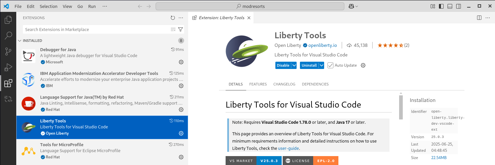</kbd>

    e. Close the extension details and switch to the **Project Explorer** view.
    
    <kbd></kbd>

    f. At the bottom, you can see the **Liberty Dashboard** which is part of the Liberty Tools. You will use it later on.

    <kbd></kbd>

### Complete the setup of the watsonx Code Assistant extension

1. Click on the shortcut for the **watsonx Code Assistant**.

    <kbd></kbd>

2. If you see on the welcome screen a blue button to **Log in with your API key**, follow these steps to add the watsonx Code Assistant API key. 

    1. On the welcome screen, click on **Log in with you API key**.
 
        <kbd></kbd>

    2. On the pop-up, click **Allow** to sign in.

        <kbd></kbd>

    3. Enter the provided API key into the entry field.

        <kbd></kbd>
 
    4. Wait until you get a message changes to **Valid API** Key. 

        <kbd></kbd>
 
    5. Press **Enter** to confirm the key.

3. You should see a Chat session.
 
    <kbd></kbd>

4. Enter **/help** and click on the **blue arrow**.

    <kbd></kbd>

 
5. You should see a short introduction. Feel free to expand the different sections.

    <kbd></kbd>

### Build the war file via maven (necessary for the next steps)

1. Open a terminal window in VS Code via the menu option **Terminal > New Terminal**.

    <kbd></kbd>

2. Run the command 

        mvn clean

    You should see something like

    <kbd></kbd>

    Make sure that you get a **BUILD SUCCESS** message

3. As the modresorts project depends on was_public.jar, you must make it visible to maven to avoid build failures. Run the following command 

        mvn install:install-file -Dfile=./was_dependency/was_public.jar -DpomFile=./was_dependency/was_public-9.0.0.pom

    You should see something like

    <kbd></kbd>

    Make sure that you get a **BUILD SUCCESS** message

4. Run the command to package the application

        mvn package

    You should see something like

    <kbd></kbd>

    Make sure that you get a **BUILD SUCCESS** message

     

    > **Hints**:
    > - The build of the application is needed to perform watsonx Code Assistant tasks on Enterprise Java Application level (e.g. explain, modernize, upgrade).
    > - If you did not install the file was_public.jar into maven, the maven command will fail with an error like:   Could not resolve dependencies for project com.acme.modres:modresorts:war:2.0.0: The following artifacts could not be resolved: com.ibm.websphere.appserver:was_public:jar:9.0.0 (absent)

 

**Now you are ready to start with the modernization of your application.**

 

### Scenario: Understand the Java Enterprise application modresorts

 How to use the WCA code explanation capabilities. 

One of the challenges during an application modernization project is often, that there is no good documentation about the application code available. Often also the developers that developed the application initially are no longer available.
You will use the explain capabilities in watsonx Code Assistant to get a better understanding of the Java Enterprise applications. 
This will include three parts:

- Get a better understanding of the modresorts application overall by using some of the Enterprise Java Application capabilities of watsonx Code Assistant.
- Get a better understanding of modresorts classes and methods or other files by using some of the core capabilities of watsonx Code Assistant.
- Get a better understanding of the modresorts applications by asking questions by using some of the core capabilities of watsonx Code Assistant.
 
#### Use watsonx Code Assistant to explain the application

1. Within the project, click on the Project Explorer shortcut.
  
    <kbd></kbd>

2. Click on **MODRESORTS** to expand the application project, then right-click on **src** and select **watsonx Code Assistant > Explain Application**
 
    <kbd></kbd>

    **Hint**:
    As the VS Code Extension "Application Modernization Accelerator Developer Tools" is also installed, there is an additional menu option called "Modernize Java Applications". Please ignore that for the lab.
 
3. You will get a pop-up like:

    <kbd></kbd>

    If the class files of the application cannot be found in the project, WCA will inform you that a built must be performed before.

4. Click on **Proceed with code analysis**. 
You will see something several messages

    <kbd></kbd>

    Then after a minute or so:

    <kbd></kbd>

    And then

    <kbd></kbd>

    HINT: If the pop-up does not appear, click on the Notification icon 

    <kbd>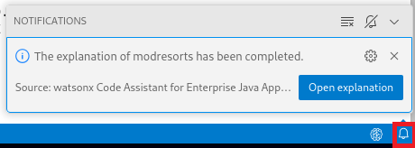</kbd>

5. Click on **Open explanation** to see the results.
 
    <kbd></kbd>
    
    After the executive summary, all the found services will be explained. Scroll down and you can see that you save the explanation as a markdown file. You do not need the explanation later, so you don't have to save it.

 

#### Use the wizard inside the application code to explain a class:

1. In the Project Explorer, expand the **src** directory and open in the directory **src/main/java/com/acme/modres** the file **Constants.java**.

    <kbd>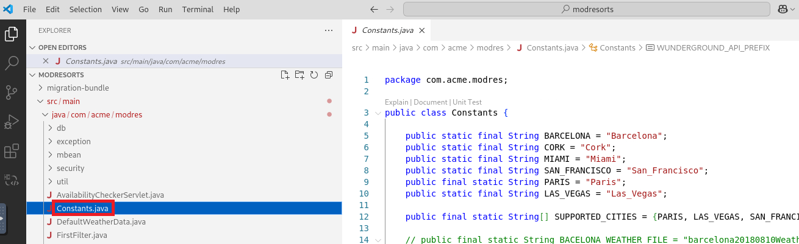</kbd>

2. Click on **Explain** to get the explanation for the class Constants.java.

    <kbd></kbd>
 
    This will trigger watsonx Code Assistant to analyze the code.

3. The WCA chat window will open to explain the class Constants. Take a look at the resulting explanation.

    <kbd></kbd>

#### Use the chat command to explain a class or method:
Another way to get an explanation for a class is to use the chat window directly.

1. Enter into the chat window the text **/explain @WeatherServlet.java** and select the java class that is offered. 

    <kbd>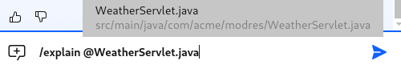</kbd>

2. Press the **blue arrow** and you should get an explanation like:

    <kbd></kbd>

 

3. The **WeatherServlet** refers to the method **getDefaultWeatherData**. So let's get an explanation of that method. Enter into the chat window the text **/explain @getDefault**. As you can see, it will find the method call in the WeatherServlet class and the method in the DefaultWeatherData class. Click on the method in the DefaultWeatherData class.

    <kbd></kbd>

4. Press the **blue arrow** and you should get an explanation like:

    <kbd></kbd>

 

#### Use the WCA chat to ask questions about the application
As mentioned above, the chat function within watsonx Code Assistant can also be used to ask questions about the code for example. Here some examples

1. In the chat window, enter the question: **Where does the weather data come from?** and press the **blue arrow**.

    <kbd></kbd>

    The answer could look like this:

    <kbd>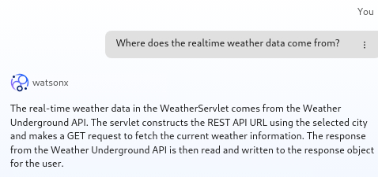</kbd>

    
2. In the chat window, enter the question: **Which class is calling the Weather Underground API?** and take a look at the result.

    <kbd></kbd>

    
3. In the chat window, enter the question: **What happens if the Weather Underground API is not available?** and take a look at the result.

    <kbd></kbd>

4. In the chat window, enter the question: **What is displayed in the web page if the Weather Underground API is not available?** and take a look at the result.

    <kbd>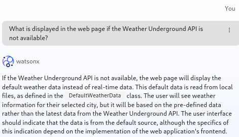</kbd>
    
 

There are additional questions that you could ask. For example:

- What is the Weather Underground API?
- Who is providing the Weather Underground API? 
- What is the purpose of the modresorts application?

#### Understand: Summary
As you could see, watsonx Code Assistant makes it much easier to understand the code. Instead of having to read through all the application code and understand it, you can get explanations or ask questions or even use a combination to get the insight that you need. 

Additional capabilities that have not been covered as part of the section are the generation of code documentation for example.

#### Housekeeping
Within VS Code, close any open file like the WeatherServlet.java for example.

### Scenario: Modernize the modresorts application from WebSphere Traditional to Liberty

How to use WCA to modernize the runtime

 

watsonx Code Assistant helps with the application modernize from a traditional application server like WebSphere Application Server Traditional, Oracle WebLogic, JBoss EAP or Tomcat to Liberty. It uses a binary scanner to scan the existing Java Enterprise applications and provides insight into issues when migrating to Liberty and/or another Java version. It also can scan the existing application server configuration.
The generated data collection can be used as input for Transformation Advisor to estimate modernization efforts as well as to generate the deployment artefacts as part of a migration bundle.
In this case, the IBM Transformation Advisor was used to scan the application and create a migration bundle which contains next to the reports about required code changes also the Liberty server configuration (server.ml).
The data collection can be found in the file **ta-collection/ AppSrv01.zip**, the generated migration bundle in the file **migration-bundle/modresorts.ear_migrationBundle.zip**

#### Modernize: Analyze the application via watsonx Code Assistant for Enterprise Java Application 

1.	Switch to the **Project Explorer**, expand the **modresorts** application and right click on the **src** directory. Then select **watsonx Code Assistant > Modernize to Liberty**.

    <kbd>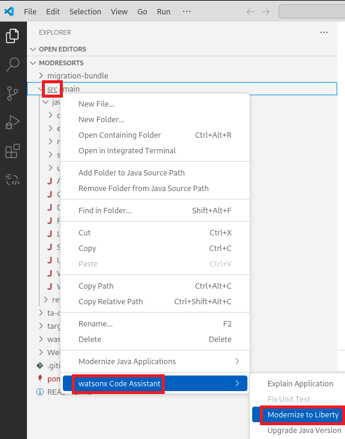</kbd>

    A panel opens and you can either upload a migration bundle or let the WCA extension scan the code. 

    <kbd></kbd>

 
2. Select the option **Upload migration bundle**.

    <kbd></kbd>

    In the pop-up **Open File**, navigate to the directory **/home/techzone/Student/labs/wca/temp-\*/modresorts/migration-bundle** and select the file **modresorts.ear_migrationBundle.zip**, the click on **Open**.
 
    <kbd>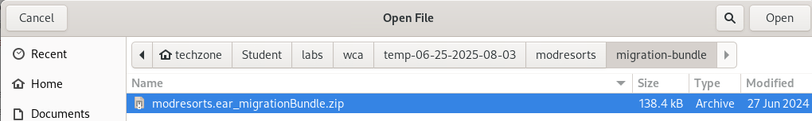</kbd>

    - That migration bundle has been generated by Transformation Advisor as a result of scanning the ModResorts application that was deployed to the traditional WebSphere Application Server environment. 
    - It contains configuration information for the application (the server.xml), and analysis that describes the issues that need to be addressed (the code changes that need to be made) in order for the application to run successfully on Liberty.

3. You should see the following screen after choosing the migration bundle:

    <kbd></kbd>

    - The **server.xml** contains the configuration for the application. 
    - The Containerfile can be used to build a Liberty image of your application (outside the scope of this scenario)
    
4. Click the button **Proceed** which will add the selected files to the project. You should see the following panel:
 
    <kbd></kbd>

    You will see **4 issues** that must be fixed before the application can run successfully in Liberty. Three of the issues have automated fixes, and one issue has an assisted fix using the watsonx Code Assistant. 

     

    > - If you want to get more details about the issues, click on the blue link called **View analysis report**. 
    > - To get more details about the architecture of the application and the used standards, take a look at **View inventory report**.
    
   

#### Modernize: Test the application as is to show the impact of the issues

At this point **BEFORE** you actually fix the issues, it is interesting to take a look at the ModResorts application. Because you have the server.xml in place, the application can be run on Liberty, although you will expect that at least some functionality is broken because you have not yet addressed the issues. 

To launch the application, you must start the Liberty server which will be installed under the cover by the related maven process.

1. Open the **Liberty Dashboard** and find the application **modresorts**.

    If the application is not listed, click the reload button on the right.

    <kbd></kbd>

    Finally you should see the **modresorts** application listed.

    <kbd></kbd>

2.	Right-click on the application **modresorts** and select **Start** to start the Liberty instance including the application.
 
    <kbd></kbd>

3.	The terminal window will show the startup of the application server.
 
    <kbd></kbd>

    Wait until the application server has completed the startup. It can take around a minute as the Liberty server packages required for the application must be downloaded from the Maven repository.
    As you can see in the terminal, Liberty will listen on port 9080. 

4.	Click on the related link in the terminal or open in a browser the URL http://localhost:9080/resorts. 

    You should see the mod resorts application UI.
 
 
    <kbd></kbd>

    
5.	Let’s take a look at a part of the functionality that is broken. Click the **Logout** button. You should see the following:

    <kbd></kbd>

    You see this exception because the logout is using a WebSphere API that is not supported on Liberty.

6.	Switch back to VS Code and see the related error message in the VS Code terminal window. You will fix the issue in the next steps.

    <kbd></kbd>

7.	Stop the Liberty instance by using the Liberty Dashboard.
 
    <kbd></kbd>

   
#### Modernize: Resolve the automated fix issues using watsonx Code Assistant.

Now you will use watsonx Code Assistant to fix the identified automated fix issues.

1.	In VS Code, switch back to the **Modernize to Liberty** panel. 

    Scroll down and you will see on the Automated Fixes tab three issues. 
 
    <kbd></kbd>

2.	Click on the blue button called **Run automated fixes**. This will start three recipes to fix the issues. They should complete in less than a minute.

3.	In the **Output** window in VS Code, you should see that the build was successful.

    <kbd></kbd>

4.	Scroll up and click the **Rebuild and refresh** button. 
        watsonx Code Assistant will trigger a rebuild of the application and will scan it for issues.
 
     <kbd></kbd>

5.	Once done, you should observe that the 3 issues with automated fixes have gone away from the list. 

     <kbd></kbd>

    **Comment:**
    If you see that another issue has been found for which also an automated fix exists, do continue with step 6. Otherwise continue with step 9.

6.	Open the twisty next to the new issue to see the details and you will find out that it complains about the missing Liberty Maven plugin in the pom.xml. As the initional analysis was done on the migration bundle (which does not contain the pom file)  Click on **Run automated fixes** to fix that issue as well.

     <kbd></kbd>

7.	Scroll up and click the **Rebuild and refresh** button. 
        watsonx Code Assistant will trigger a rebuild of the application and will scan it for issues.
 
     <kbd></kbd>

8. Wait until the rebuild and refresh has completed, than take a look at the results. The only remaining issue left should be under Assisted Fixes.

    <kbd></kbd>

9. You might be interested to see which changes have been performed by the automated fixes. Open the **Source Control** to review the changes.

    <kbd>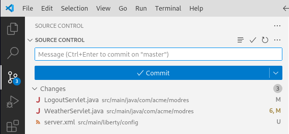</kbd>

    As you can see, some files have been modfied and the server.xml has been added.

10. In the **Source Control** view, click on **LogoutServlet.java** to see the changes.

    <kbd></kbd>

    As you can see, the WSSecurityHelper method has been replaced automatically with the appropriate method for Liberty. This will resolve the logout issue.

11. In the **Source Control** view, click on **WeatherServlet.java** to see the changes.

    <kbd></kbd>

    As you can see, the code to get the server name and the initialContext have been adjusted automatically to work for Liberty.

12. Close the comparison view to switch back to the **Modernize to Liberty** tab.

#### Modernize: Resolve the assisted fix issues using watsonx Code Assistant
Now we will use watsonx Code Assistant to fix the remaining issue.

1. Switch to the tab called **Assisted fixes** and take a look at the issue.

   <kbd></kbd>

2.	Open the two twisties to see the details of the issue as well as the guideline how to fix it.

    <kbd></kbd>
 
3. Click on the blue link to open the file **UpperServlet.java** in the IDE. The UpperServlet.java window will open in a new group
and you can see the instructions and the code next to each other.
 
    <kbd></kbd>

4.	You could select the class or the method that uses the **ResponseUtils.encodeDataString()** method. In this case, select the whole class. On the **Modernize to Liberty** tab, click the button **Help me**.

    <kbd>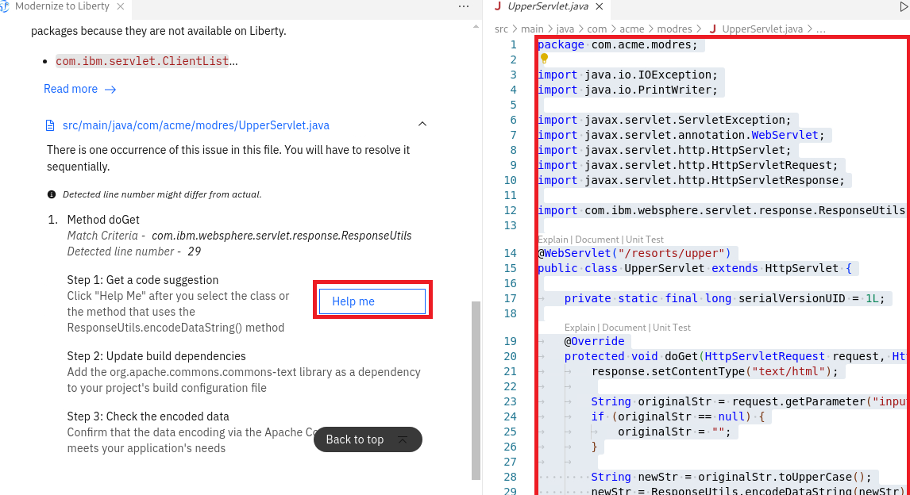</kbd>

5. The IDE will automatically open the chat window, and you will see that watsonx Code Assistant is working on the solution. After a couple of moments, you should get a code snippet returned:
 
    <kbd>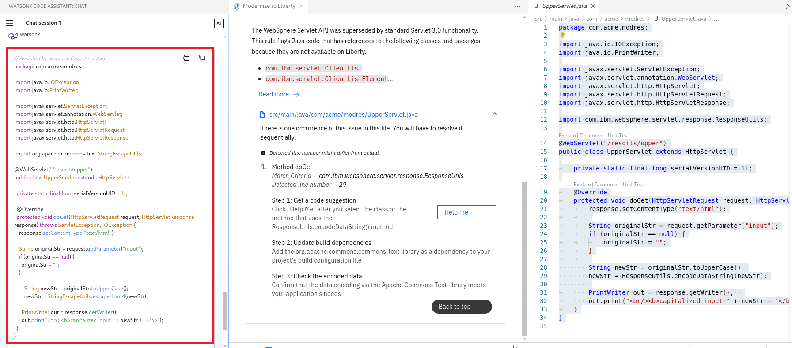</kbd>

    The code suggestion shows how the Apache Commons Text library can be used instead of the ResponseUtils.encodeDataString() method

6.	Take a look at the recommended changes. The returned solution consists of two parts:

    - The returned code snippet contains the code you selected but adjusted to fix the issue. 
    - The required adjustment to the pom file to reflect the additional dependency.

7. Replace the previously selected with the code recommended by watsonx Code Assistant.

    You could use copy and paste to update the code. But as the code to be replaced has already been selected, you can use the function **Insert at cursor** to replace the code.

    a. Click on the tab **UpperServlet.java** to give it focus (but keep the code selected). Then click in the chat on the icon **Insert at cursor**. 

    <kbd>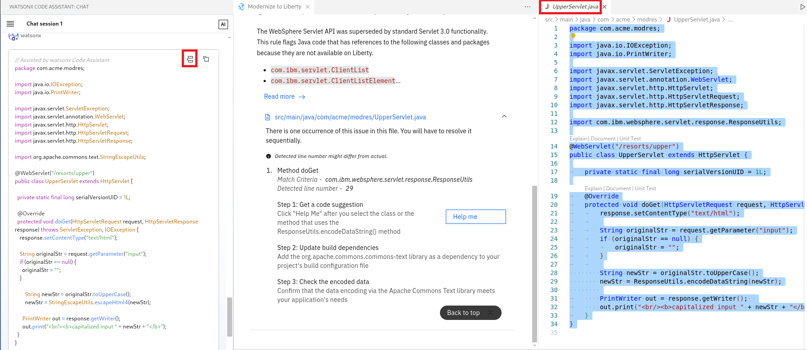</kbd>

    b.	Review the updated code which should look like this:
    
    <kbd>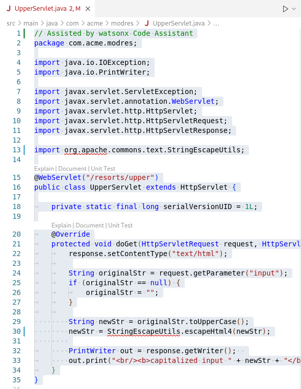</kbd>

    c.	Save the code changes, then close the Java class.
    

8.	Add the recommended dependency to the pom.xml. 

    a.	Switch to the **Project Explorer** and open the **pom.xml**
 
    <kbd></kbd>

    b.	Switch to the watsonx Code Assistant and scroll down to see the additional dependency that needs to be added to the **pom.xml**. 
 
    <kbd></kbd>

    c.	In the **pom.xml**, create an empty line after the line **\<dependencies>**. Switch to the chat window and click on the icon **Insert at cursor**.

    <kbd></kbd>

    d. Review the code update that should look like this:

    <kbd></kbd>

    e.	Save the configuration change and close the pom file.

9.	If not automatically done, switch to the **Modernize to Liberty** tab. Scroll to the top and click on **Rebuild and refresh**.

    <kbd></kbd>
 
10.	Watsonx Code Assistant rebuilds the code and scans it again. The issue should have gone.

    <kbd></kbd>

#### Modernize: Test the application again to show if the issue has been resolved

To launch the application, you must start the Liberty server which will be installed under the cover by the related maven process.

1.	Switch to the **Project Explorer** and use the **Liberty Dashboard** to start Liberty:

    <kbd></kbd>

2.	Monitor the Terminal window to see when the server has been started.
 
    <kbd></kbd>

3.	Click on the related link in the terminal or open in a browser the URL http://localhost:9080/resorts. 

    You should see the mod resorts application UI.
 
    <kbd></kbd>

    
4.	Click on **Logout** and verify that the Logout has been fixed.

    You should see a login page similar to this:

    <kbd></kbd>

    For ease of demo setup, security for the application is actually turned off. You can enter any credentials and click login.

5.	Switch back to VS Code and stop the Liberty instance by using the Liberty Dashboard.
 
    <kbd></kbd>

#### Housekeeping
Within VS Code, close any open tab like the Modernize to Liberty tab for example.

Congratulations, you have just migrated an enterprise application from WebSphere Traditional to Liberty. ModResorts is now a Liberty application! At this point, your code should be the same as the code in the zip called modresorts-lib-j8.zip. 

**===== END OF Application Modernization LAB =====**

### Scenario: Upgrade the Java version of the modresorts application

How to use WCA to upgrade the Java version

 
watsonx Code Assistant helps to upgrade a Java Enterprise application from Java 8 to Java 17 or Java 21. This scenarios assumes that the ModResorts application has already been modernized to work on Liberty. It begins with the code in the state that we finished the Modernize to Liberty scenario. You can also start the scenario by starting with the zip called modresorts-lib-j8.zip.

#### Upgrade: Identify the issues resulting of a Java upgrade

1.	Switch to the **Project Explorer**, expand the **modresorts** application and right click on the **src** directory. Then select **watsonx Code Assistant > Upgrade Java Version**.

     <kbd>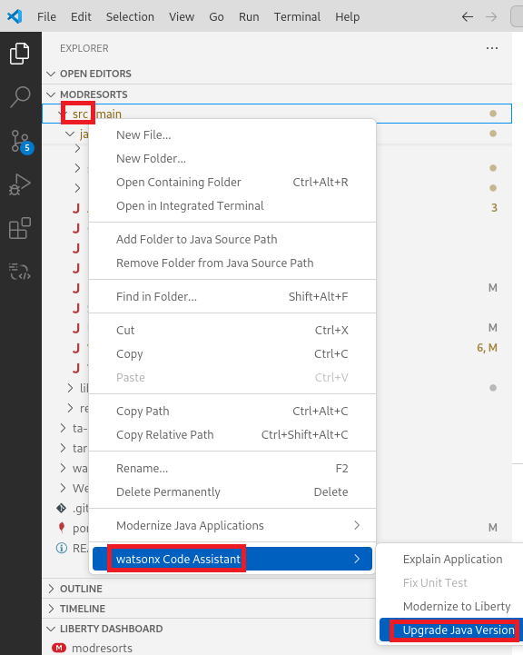</kbd>
 
2.	The **Upgrade Java Version** view opens

     <kbd></kbd>

    a.	The **Source Java** version is selected based on the build configuration but can be changed.

    b.	The list of **Target Java** versions depends on the selected source version. For Java 8 as source, the target options are currently Java 11, 17 and 21. For older Java versions, also Java 8 is available as target .

3.	Before you analyze the application, the application needs to be built. 

    If it's not built at this point, build it now from the terminal via command: 

        mvn clean package 

4.	Expand the list of targets and select your target Java based on your environment. In this case, you will use **Java 17**.
 
     <kbd></kbd>

5.	Once you have selected a target Java, the **Build and analyze** button gets enabled.

     <kbd></kbd>

6.	Click the **Build and analyze** button to analyze the application for target Java 17 (in this case). After a few moments you should see the issues. There are two issues with an automated fix and one issue with an assisted fix:
 
     <kbd></kbd>
 

#### Upgrade: Test the application on the target Java before upgrading

1.	At this point you can run ModResorts in a Java 17 environment to observe how the application is not functioning correctly **BEFORE** you fix the Java upgrade issues. 

    a.	To start Liberty, open the **LIBERTY DASHBOARD** in the side panel, right-click on **MODRESORTS** and select **Start**.
  
     <kbd></kbd>

    b.	Monitor the **Terminal** window and wait until Liberty has been started.
 
     <kbd>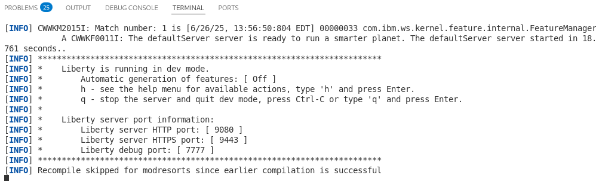</kbd>

    c.	Click on the related link in the terminal or open in a browser the URL http://localhost:9080/resorts. 

     <kbd></kbd>
 
    d.	Click the **Where to** drop-down. Select any value. You should observe errors in the UI:

     <kbd></kbd>
 
    e. Take a look at the VS Code  **Terminal** window and you should see a servlet exception related to **MBeanOperatorInfo** 

     <kbd></kbd>
 
    These errors are ultimately the result of the Java upgrade issue with the **MBeanOperatorInfo constructor** which causes a server error when fetching data for the UI.

    f.	Stop the Liberty instance via the **Liberty Dashboard**

     <kbd></kbd>
 

#### Upgrade: Resolve the automated fix issues

1. In VS Code, click the **Run automated fixes** button.

     <kbd></kbd>

2. Once the fixes have been applied, click on **Rebuild and refresh** to check if the issues have been resolved.

     <kbd></kbd>

3.	Review the results and verify that there is no automated fix issue remaining.

     <kbd></kbd>

#### Upgrade: Resolve the assisted fix issues
1. Switch to the tab for **Assisted fixes**.

     <kbd></kbd>

    The issue **Behavior change in the javax.management.MBeanOperationInfo constructor** is listed which is the one that caused the dispay errors. You will resolve the issue with the help of the watsonx Code Assistant. 

2.	Scroll down and open the two twisties to see the guidance how to fix the issue.

     <kbd></kbd>

3.	Open the **DMBeanUtils** class by clicking on the **blue link**. This will open the class in a new group and you can see the instructions and the code next to each other.

     <kbd></kbd>

4.	Select the **DMBeanUtils** class, then click in the left tab on **Help me**.

     <kbd></kbd>

5.	watsonx Code Assistant generates a code suggestion to fix the issue.

     <kbd></kbd>
 
6.	Review the changes, which are mainly in the try-catch block, then replace the previously selected code with the suggestion provided by watsonx Code Assistant. You can use the **Insert at cursor** function to update the code.

     <kbd></kbd>

7.	Your final update code should look like this:

     <kbd></kbd>

8.	**Save** the code, then close the java class.
    
9. On the tab **Upgrade Java Version**, click on **Rebuild and refresh**.

     <kbd></kbd>

10.	If everything worked well, all issues should have been resolved.

     <kbd></kbd>

## Upgrade: Test the application if the error has been resolved

1.	Switch to the **Explorer view** and start the application using the **LIBERTY DASHBOARD**  in the side panel.
  
     <kbd></kbd>

2.	Monitor the **Terminal** window and wait until Liberty has been started.
 
     <kbd>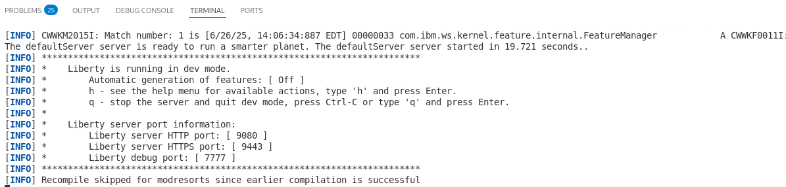</kbd>

3.	Click within the terminal on the **application link** or open the URL **localhost:9080/resorts** in a browser.

     <kbd></kbd>
 
4.	Click the **Where to** drop-down. Select any value. You should observer that the previous errors in the UI have been resolved.

     <kbd></kbd>
 

 5. Stop the Liberty instance via the Liberty Dashboard

     <kbd></kbd>

 
Congratulations, you have just migrated an enterprise application from Java 8 to Java 17.

**===== END OF the Application Upgrade LAB =====**

  

Congratulations! You have successfully used **watsonx Code Assistant** to perform different tasks during an application modernization journey. 

 

**===== END OF LAB =====**

 

# Appendix

How to set up the lab environment and more

## How to set up Visual Studio Code and the watsonx Code Assistant Plugin
If an environment is provided to you, this section is only for your interest and to get a better understanding - the steps described here have already been performed.

### Install VS Code
You can download Visual Studio Code (VS Code) from the side https://code.visualstudio.com/download. 

- To check the VS Code version, use the command 

        code -v

- To see the available VS Code commands, use the command 

        code --help

- If you are on an older version of VS Code, update to 1.86.0 or later or you will later on get an error in the WCA output logs like

        2024-11-13 07:14:44 - [wca] - [INFO]: - Launching LSP /home/techzone/.vscode/extensions/ibm.wca-core-1.0.21/assets/common/server.min.cjs
        2024-11-13 07:14:52 - [wca] - [ERROR]: - Could not instantiate LSP [Error: The language client requires VS Code version ^1.86.0 but received version 1.85.1

    To update VS Code, open VS Code. In VS Code, select **Help > Update**, then open the URL (https://code.visualstudio.com/docs/setup/setup-overview) and follow the steps provided. Then stop and start VS Code.
    In the provided environment, those steps have already been done.

#### How the update to VS-Code 1.95.1 was done in this environment:

1. In VS-Code, select Help > Update, then open the URL https://code.visualstudio.com/
2. Select rpm and follow the instructions to execute the following commands. For your convenience, here the commands:

        sudo rpm --import https://packages.microsoft.com/keys/microsoft.asc
    
        echo -e "[code]\nname=Visual Studio Code\nbaseurl=https://packages.microsoft.com/yumrepos/vscode\nenabled=1\ngpgcheck=1\ngpgkey=https://packages.microsoft.com/keys/microsoft.asc" | sudo tee /etc/yum.repos.d/vscode.repo > /dev/null

        dnf check-update
    
        sudo dnf install code # or code-insiders

3. Stop and start VS-Code.

### Install the Visual Studio Code extensions for watsonx Code Assistant 
There are two extensions required to install wats, the one for WCA Core and the one for WCA EJA. The extension WCA-EJA will install the WCA Core automatically.

Steps to install the extension for WCA for Enterprise Java Applications

1. Switch to the Extensions View in VS-Code.

    <kbd></kbd>

2. In VS-Code, enter **watsonx** to search in the marketplace for watsonx extensions: 
 
    <kbd></kbd>

3. Select **watsonx Code Assistant for Enterprise Java Applications**, then select Install.:
    <kbd></kbd>

    The extension will also add the extension for watsonx Code Assistant Core.
    Finally, you should see both extensions. 

4. Click on the extension **watsonx Code Assistant for Enterprise Java Applications** and take a look at the description

    <kbd></kbd>

### Configure watsonx Code Assistant 

To access the cloud-based watsonx Code Assistant, an API key must have been provided.

1. Click on the shortcut for watsonx Code Assistant.

    <kbd></kbd>

2. On the welcome screen, click on Log in with you API key.
 
    <kbd></kbd>

3. On the pop-up, click Allow to sign in.

    <kbd></kbd>

4. Enter the provided API key into the entry field.

    <kbd></kbd>
 
5. Wait until you get a message changes to **Valid API** Key. 

    <kbd></kbd>
 
6. Press **Enter** to confirm the key.

7. In the chat session, you should see a Chat session.
 
    <kbd></kbd>
 
### Test if the WCA chat works 

1. Enter **/help** and press **Enter** or click on the blue arrow.

    <kbd></kbd>

 
2. You should see a short introduction. Feel free to expand the different sections.

    <kbd></kbd>

Your watsonx Code Assistant is now ready to be used. 

## Install the Liberty Tools extension

To follow the application modernization part of the tutorial, install the Liberty Tools extension. Switch to the extensions view and search for Liberty Tools, then install them.

<kbd></kbd>

Switch back to the Project Explorer view and you should see the Liberty Dashboard at the bottom.

<kbd></kbd>

 
## How to reset the environment for another demo

If you ran the “Modernize to Liberty” use case once, it will be remembered until you do the task again from another project directory.

The following script called **modresorts_demo_setup.sh** “resets” the environment by creating a temporary path which then includes the modresorts application.

To reset the environment, follow these steps:

1. Delete the old directory “temp-xxx” via the command 

        rm -rf temp-*

2. Run the script to create a new environment.
To run the script and switch automatically into the new project directory, use the following command: 
(the “. “ makes sure that the script will not start a new process and therefore the cd command stays effective even after the shell script stopped.)

        . modresorts_demo_setup.sh

Content of the file **modresorts_demo_setup.sh**

     #!/bin/bash
    NOW="$(date +"%m-%d-%Y-%H-%M")"
    DIR="temp-$NOW/modresorts"
    mkdir -p $DIR
    cd $DIR
    unzip ~/software/modresorts*.zip
    git init
    git config --global user.name "John Doe"
    $ git config --global user.email johndoe@example.com
    git add .
    git commit -a -m "Initial project"

## How to install gradle
To install grade and register it to the system, use the following commands:

    cd ~/Downloads
    wget https://services.gradle.org/distributions/gradle-8.12-bin.zip
    unzip gradle-*.zip
    sudo mkdir /opt/gradle
    sudo cp -pr gradle-*/* /opt/gradle
    sudo echo "export PATH=/opt/gradle/bin:${PATH}" | sudo tee /etc/profile.d/gradle.sh
    sudo chmod +x /etc/profile.d/gradle.sh
    source /etc/profile.d/gradle.sh

To test if gradle works, run the following command

    gradle -v
    

Troubleshooting

## Troubleshooting

### Enable WCA extension debugging
To get more insight what happens in WCA under the cover and debug issues, you can set WCA in debug mode.
These are the steps to do so:

Open the **watsonx Code Assistant extension** (not the one for Enterprise Java Applications).

<kbd></kbd>

Click on the gear to open the menu with the management options.

<kbd></kbd>

Select **Settings**

<kbd></kbd>

Scroll down to the section **Wca Log Level** and set the Log level for example to **TRACE**

<kbd></kbd>

Now you should see debug information in the WCA output panel:

<kbd></kbd>

 

### Troubleshooting API key
If you insert your API key into VS Code and the key is shown as not valid, check the WCA output if any rason is shown.
If there seems to be a connectivity problem, please check if you can reach the login API via command line:

On Linux, ise the following command:

        curl -X POST 'https://iam.cloud.ibm.com/identity/token' -H 'Content-Type: application/x-www-form-urlencoded' -d 'grant_type=urn:ibm:params:oauth:grant-type:apikey&apikey=MY_APIKEY'

On Windows Powershell, the curl calls under the cover Invoke-WebRequest. Therefore the syntax must be adjusted to:

    curl -Method 'POST' -Uri 'https://iam.cloud.ibm.com/identity/token' -header @{'Accept'='application/json'} -ContentType 'application/x-www-form-urlencoded' -body @{'grant_type' = 'urn:ibm:params:oauth:grant-type:apikey';'apikey'='<API-LEY>'}

You could also call directly the Invoke-WebRequest

    Invoke-WebRequest -Method 'POST' -Uri 'https://iam.cloud.ibm.com/identity/token' -header @{'Accept'='application/json'} -ContentType 'application/x-www-form-urlencoded' -body @{'grant_type' = 'urn:ibm:params:oauth:grant-type:apikey';'apikey'='<API-LEY>'}

For additional details about the command, take a look at https://cloud.ibm.com/docs/account?topic=account-iamtoken_from_apikey

Good to know

## WCA Security and Privacy

Here two links regarding WCA security and privacy:

- Security and privacy for foundation models
https://cloud.ibm.com/docs/watsonx-code-assistant?topic=watsonx-code-assistant-wca-privacy

- Securing your data in watsonx Code Assistant
https://cloud.ibm.com/docs/watsonx-code-assistant?topic=watsonx-code-assistant-mng-data

## Display of Code Suggestions
IBM watsonx Code Assistant checks whether a generated code suggestion is similar to other code sources.

By default, IBM watsonx Code Assistant blocks code that is similar to other code sources.
You can change this setting for selected license types to show the code suggestion alongside a reference to the similar code source and its license.

<kbd></kbd>

Extract of the differnt license types:

<kbd></kbd>

For a full list of which licenses are blocked by default and which licenses can be configured, see the watsonx Code Assistant documentation at 
https://cloud.ibm.com/docs/watsonx-code-assistant?topic=watsonx-code-assistant-cloud-setup-configurations

## How to install the WCA drivers without access to the market place

If your development environment does not have access to the VS-Code Market Place, you can download the VSIX files for air-gapped installation.

Step 1: Download the two required drivers

- Download the WCA Core extension via command:

        wget https://IBM.gallery.vsassets.io/_apis/public/gallery/publisher/IBM/extension/wca-core/latest/assetbyname/Microsoft.VisualStudio.Services.VSIXPackage -o IBM.wca-core.latest.vsix

- Download the WCA EJA extension via command:

        wget https://IBM.gallery.vsassets.io/_apis/public/gallery/publisher/IBM/extension/wca-eja/latest/assetbyname/Microsoft.VisualStudio.Services.VSIXPackage -o IBM.wca-eja.latest.vsix

Step 2: Transfer the two vsix files to the target machine where VS-Code is installed.

Step 3: Switch in VS Code to the VS-Code Extensions page, and select the option **Install from VSIX** to install first the WCA-Core extension, then the WCA-EJA extension.

Comment: 
**For Eclipse**, the approach is similar.
If your environment has no access to the Eclipse Market Place but is allowed to access IBM sites, add the following two repository URLs under "Help > Install New Software" and install from there.
Otherwise download the repositories as ZIP.

The related links to the driver repositories are: 
- https://public.dhe.ibm.com/ibmdl/export/pub/software/wca/wca-core/latest/
- https://public.dhe.ibm.com/ibmdl/export/pub/software/wca/wca-eja/v1.0.1/

## How to improve the WCA chat results

Hint:

The answer to a question is only as good as the context that has been provided. 

** How to explain all classes of a project? ***

To set the context, you could use the following commands:

1. Create a list of all relevant files

    a) On Windows, use a command like 
        
        dir /s/b *.java > modres_java.txt

    b) On Linux, use a command like 
    
        find ./src -type f | grep java > modres_java.txt

2. In chat, enter the following "command" to get all files explained and loaded:

        explain all files listed in @modres_java.txt

3. Once the files has been interpreted, you can ask questions like:
    - "what is the purpose of the modres application?"
    - "what happens if the weather data endpoint is not available?"

